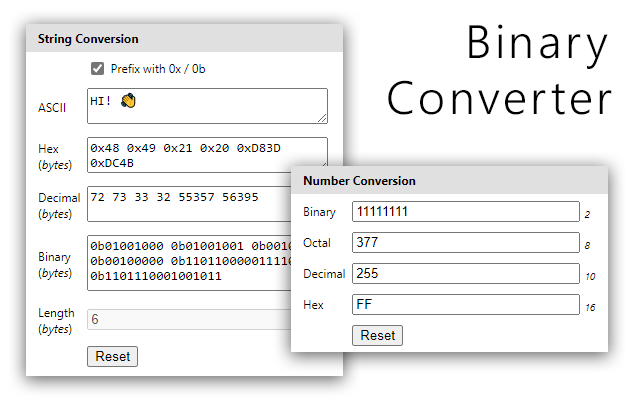

# Binary Converter

Binary Converter is a browser extenstion that converts numbers and ASCII text to Binary, Hex, Decimal and Octal number system.

> Conversions based from https://www.rapidtables.com

## Number Conversion

Convert a number to and from the number systems:

- Binary - _base_ 2
- Octal - _base_ 8
- Decimal - _base_ 10
- Hexadecimal - _base_ 16

## Text Conversion

Convert ASCII text to:

- Binary
- Decimal
- Hexadecimal

> You can also select the option checkbox to to prefix Hexadecimal and Binary with `0x` and `0b` .

## User Interface

